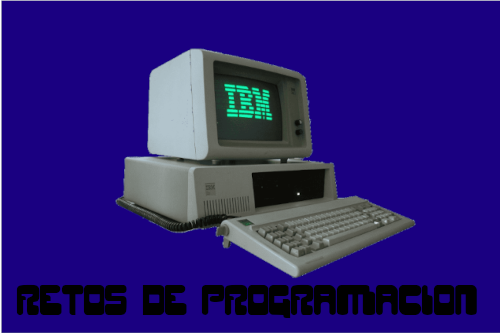

## Hola como va 👋
## Todo esto comenzó con por un zx spectrum 128K.
## Mi primer programa fue hecho en Basic 🤔.
## Hize un curso donde me aprendí Basic, Cobol y C .Pero
## los pc´s eran del aÑo  90 con ms-dos 💾
## ⬜⬜⬜⬜⬜⬜👾👾👾👾👾👾👾👾⬜⬜⬜⬜
## ⬜⬜⬜⬜⬜👾👾👾👾👾👾👾👾⬜⬜⬜⬜⬜
## ⬜⬜⬜⬜👾👾👾👾👾👾👾👾⬜⬜⬜⬜⬜⬜
## ⬜⬜⬜⬜⬜⬜⬜🔺⬜⬜⬜⬜⬜⬜⬜⬜⬜⬜
## ⬜⬜⬜⬜⬜⬜🔺⬜⬜⬜⬜⬜⬜⬜⬜⬜⬜⬜
## ⬜⬜⬜⬜⬜🚀⬜⬜⬜⬜⬜⬜⬜⬜⬜⬜⬜⬜
##

<!--
**CarlosVR48/CarlosVR48** is a ✨ _special_ ✨ repository because its `README.md` (this file) appears on your GitHub profile.

Here are some ideas to get you started:

- 🔭 I’m currently working on ...
- 🌱 I’m currently learning ...
- 👯 I’m looking to collaborate on ...
- 🤔 I’m looking for help with ...
- 💬 Ask me about ...
- 📫 How to reach me: ...
- 😄 Pronouns: ...
- ⚡ Fun fact: ...
-->
